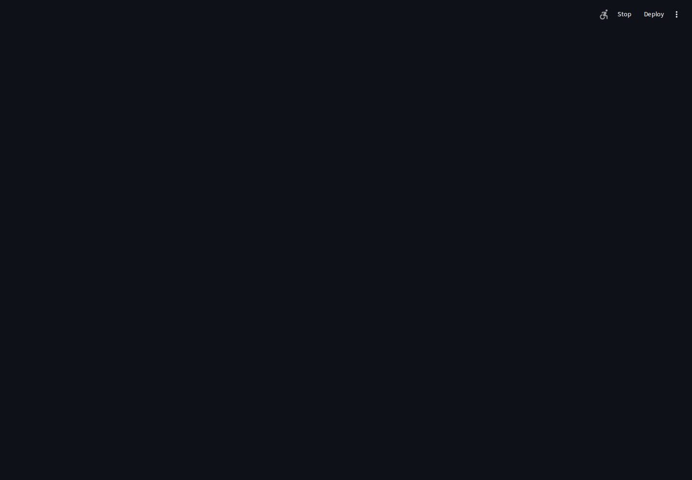
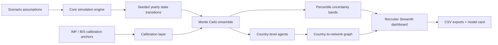

# Monetary Network Resilience Simulator

> **Renteria AI Systems Portfolio · Scenario Modeling & Resilience**

[](START_HERE.md)
[](demo/recruiter_app.py)
[](requirements.txt)
[](demo/recruiter_app.py)
[](https://github.com/gdintentions/renteria-monetary-network-resilience-simulator/actions/workflows/demo-tests.yml)

**[Start Here: portfolio map →](START_HERE.md)**

A portfolio-grade scenario simulator for exploring how competing global monetary and payment networks could evolve over a 10–15 year horizon under geopolitical, fiscal, cyber, commodity, and digital-currency shocks.

## Portfolio role

This is the portfolio’s **quantitative systems and resilience layer**. It demonstrates how uncertain, interacting systems can be represented with transparent assumptions, seeded simulations, agent behavior, network structure, public-data calibration, and recruiter-friendly visual analysis.

## Recruiter demo screenshot



> The screenshot is generated from the live Streamlit recruiter demo by GitHub Actions so it stays aligned with the current code.

## Architecture at a glance



## What the model includes

The core model tracks six network actors: U.S./USD, BRICS settlement, Europe/EUR, gold, bitcoin & stablecoins, and neutral/multi-aligned states. The baseline scenario includes a BRICS gold-linked settlement unit, partial oil de-dollarization, a U.S. debt-confidence shock, cyberattack disruption, and rapid digital-currency adoption.

The recruiter build adds:

- Monte Carlo analysis with 10th / median / 90th percentile bands
- 12 country-level agents
- country-to-network graph visualization
- historical calibration signals
- concentration and diversification diagnostics
- reproducible seeds
- CSV export
- transparent model-card disclosures
- automated tests and CI

## Model flow

For each simulated year, each network receives a relative weight derived from structural growth, lingering shock memory, active shocks, and seeded stochastic variation. Those weights are normalized to 100% to produce a model-internal relative attractiveness/usage share.

The Monte Carlo layer repeatedly executes the original engine with independent reproducible seeds and aggregates the resulting distributions by network and year.

## Historical calibration boundary

Calibration is intentionally **light-touch**. Public institutional data is used as a signal, not as a direct replacement for the simulator’s internal `share` variable.

Reference anchors currently include:

- IMF COFER 2025Q4 reserve composition
- BIS 2025 Triennial FX Survey measures

Reference rows are stored in `demo/data/calibration_reference.csv`.

## Run locally

```bash
git clone https://github.com/gdintentions/renteria-monetary-network-resilience-simulator.git
cd renteria-monetary-network-resilience-simulator
python -m venv .venv
pip install -r requirements.txt
pytest -q
streamlit run demo/recruiter_app.py
```

Original lean dashboard:

```bash
streamlit run app.py
```

Core CLI model:

```bash
python simulator.py
```

## Repository structure

```text
simulator.py                 core simulation engine
app.py                       original Streamlit dashboard
demo/hardening.py            Monte Carlo, calibration, country agents
demo/recruiter_app.py        recruiter/public interface
demo/data/                    public calibration anchors
tests/                       core + advanced tests
.github/workflows/            CI + screenshot automation
START_HERE.md                portfolio-level recruiter index
```

## What this demonstrates

Python modeling, Monte Carlo simulation, agent-based modeling concepts, graph/network analysis, scenario design, public-data calibration, uncertainty communication, reproducibility, test-driven implementation, CI, and model-governance disclosure.

## Important interpretation note

`share` is a model-internal relative attractiveness/usage measure. It is **not** intended to equal official reserve composition, SWIFT payment share, trade-invoicing share, BIS FX turnover, or any single real-world metric. Monte Carlo bands describe uncertainty inside the scenario model; they are not statistical confidence intervals for real-world outcomes.

## Portfolio connection

This project complements the portfolio’s governed-RAG and multilingual systems by bringing the same design principles—transparent assumptions, measurable uncertainty, governance boundaries, reproducibility, and recruiter-safe demonstration—into scenario and network modeling.

**[Return to the portfolio Start Here page →](START_HERE.md)**

## Disclaimer

Educational and research-oriented simulation only. It is not investment, legal, economic-policy, or financial advice and should not be interpreted as a forecast.
