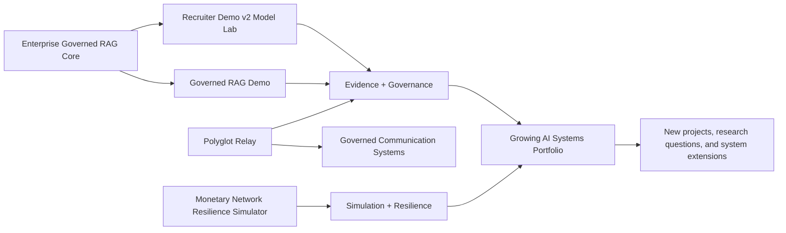

# Renteria AI Systems Portfolio — Start Here

A growing portfolio of working AI systems, governance controls, simulation models, and recruiter-safe demonstrations. The projects are designed to show not only what an AI system can do, but how it can be evaluated, explained, governed, stress-tested, and extended as new insights emerge.

[Evidence review and test results](EVIDENCE_REVIEW_2026-09-25.md) — observed checks, synthetic benchmarks, limitations, and next validation steps.

## Portfolio thesis

The portfolio is organized around five recurring questions:

1. **Can the system produce useful output?**
2. **Can the evidence behind that output be inspected?**
3. **Can risk and uncertainty be measured instead of hidden?**
4. **Can the system be stress-tested under changing conditions?**
5. **Can the architecture be extended without discarding its governance layer?**

That shared design philosophy connects document intelligence, multilingual communication, model evaluation, network analysis, and scenario simulation into one growing systems portfolio.

## How the projects fit together

## Project map

| Project | Portfolio role | What it demonstrates | Recruiter focus |
|---|---|---|---|
| **Monetary Network Resilience Simulator** | Scenario modeling & resilience | Monte Carlo simulation, settlement-network agents, network graphs, illustrative calibration inputs, uncertainty bands | Systems thinking, simulation design, quantitative modeling |
| **Enterprise AI Chatbot — Governed RAG** | Governance & evidence foundation | TF-IDF/cosine retrieval, citations, confidence scoring, safe/review/block routing, FastAPI, human review | RAG architecture, explainability, AI governance |
| **Governed RAG Demo** | Recruiter-safe operational demo | Standalone policy Q&A, evidence ranking, governance simulation, no private data or API key | Fast demonstration of grounded AI controls |
| **Governed RAG Recruiter Demo v2** | Model evaluation lab | Jaccard, TF-IDF, trigram and hybrid retrieval; MRR, Hit@3, robustness and governance calibration | Model comparison, evaluation math, robustness analysis |
| **Renteria Polyglot Relay** | Governed multilingual interaction | Voice/text workflows, quality/risk/latency models, relay decisions, transcript controls, network visualization | Responsible AI interaction design, accessibility, routing logic |
| **Renteria ArgusLoop** | Governed vision-driven automation | Typed computer-use actions, policy gating, normalized coordinates, audit logs, threat modeling, benchmark reporting | Multimodal agents, safety engineering, testable desktop automation |
| **Renteria EvidenceWeave** | Multimodal evidence intelligence | Provenance-preserving claim graphs, contradiction detection, cross-modal agreement, explainable Evidence Integrity Score | Document AI, GraphRAG, model governance, evidence auditing |

## Recommended recruiter review path — 10 minutes

**1. Start with the Monetary Network Resilience Simulator.** It is the public visual flagship and shows the portfolio’s simulation, agent, graph, calibration, uncertainty, testing, and presentation standards in one place.

**2. Review Enterprise Governed RAG.** This is the control-plane foundation: evidence retrieval, confidence, governance routing, human review, API structure, and transparent formulas.

**3. Open Recruiter Demo v2.** This shows how multiple retrieval models are compared quantitatively rather than selected by intuition alone.

**4. Review the lightweight Governed RAG Demo.** It demonstrates the same operating pattern in a compact, recruiter-safe form that requires no production credentials or private documents.

**5. Review Polyglot Relay.** It extends the portfolio from document intelligence into multilingual interaction, accessibility, and governed communication routing.\n\n**6. Review Renteria ArgusLoop.** It demonstrates a vision-powered desktop agent in which model proposals pass through deterministic risk controls, dry-run safeguards, structured validation, and an auditable execution layer.\n\n**7. Finish with Renteria EvidenceWeave.** It shows how multimodal retrieval can be upgraded into evidence intelligence through claim provenance, conflict detection, modality tracking, and transparent integrity scoring.

## Shared engineering standards

Across the portfolio, projects increasingly follow the same standards:

- clear separation between core model logic and recruiter-facing presentation
- deterministic or seeded simulations where reproducibility matters
- explicit formulas and model assumptions
- source/evidence visibility instead of opaque confidence claims
- safe/review/block or equivalent governance controls where relevant
- automated tests and GitHub Actions CI
- recruiter-safe sample data and demos
- architecture diagrams and runtime screenshots
- honest limitations and model boundaries
- extensible interfaces for future providers, models, datasets, and agents

## Growing portfolio direction

This is intentionally not a static set of five finished artifacts. Each project is a foundation for follow-on work. New projects can reuse the same patterns—evaluation, governance, uncertainty, simulation, observability, resilience, and recruiter-safe demonstration—while exploring new technical questions and insights.

The goal is for the portfolio to become progressively more connected: individual applications become reusable components, reusable components become system patterns, and those patterns become larger AI operations and governance architectures.

## Repositories

- [Monetary Network Resilience Simulator](https://github.com/gdintentions/renteria-monetary-network-resilience-simulator)
- [Enterprise AI Chatbot — Governed RAG](https://github.com/gdintentions/enterprise-ai-chatbot-governed-rag)
- [Governed RAG Demo](https://github.com/gdintentions/enterprise-ai-chatbot-governed-rag-demo)
- [Governed RAG Recruiter Demo v2](https://github.com/gdintentions/enterprise-ai-chatbot-governed-rag-recruiter-demo-v2)
- [Renteria Polyglot Relay](https://github.com/gdintentions/renteria-polglot-relay)\n- [Renteria ArgusLoop](portfolio_projects/renteria-argusloop/README.md)\n- [Renteria EvidenceWeave](portfolio_projects/renteria-evidenceweave/README.md)

> Some recruiter/demo repositories may be private. The public portfolio index remains the canonical map of how the projects relate.
