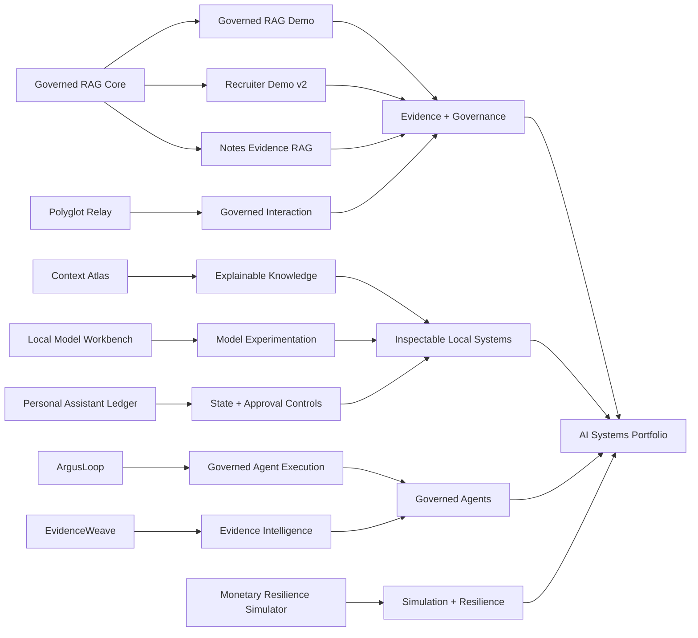

# Renteria AI Systems Portfolio — Start Here

A growing portfolio of working AI systems, governance controls, simulation models, local-first prototypes, and recruiter-safe demonstrations. The projects are designed to show not only what a system can do, but how its evidence, uncertainty, controls, limitations, and test results can be inspected.

- [Portfolio validation matrix — external benchmarks, failures, next engineering responses](docs/VALIDATION_MATRIX.md)
- [Portfolio evidence review and test results](EVIDENCE_REVIEW_2026-09-25.md)
- [Public recruiter snapshots for private-source projects](docs/PORTFOLIO_PROJECT_SNAPSHOTS.md)
- [Live browser demo-safe showcase](https://gdintentions.github.io/renteria-monetary-network-resilience-simulator/)
- [Runnable demo-safe source showcase](demo_safe/README.md)

## Portfolio thesis

The portfolio is organized around five recurring questions:

1. **Can the system produce useful output?**
2. **Can the evidence behind that output be inspected?**
3. **Can risk and uncertainty be measured instead of hidden?**
4. **Can the system be stress-tested under changing conditions?**
5. **Can the architecture be extended without discarding its governance layer?**

That design philosophy connects document intelligence, multilingual interaction, local-model experimentation, personal knowledge systems, task-state machines, agent safety, network analysis, and scenario simulation.

## How the projects fit together

```mermaid
flowchart LR
    A[Governed RAG Core] --> B[Governed RAG Demo]
    A --> C[Recruiter Demo v2]
    A --> D[Notes Evidence RAG]
    E[Polyglot Relay] --> F[Governed Interaction]
    G[Context Atlas] --> H[Explainable Knowledge]
    I[Local Model Workbench] --> J[Model Experimentation]
    K[Personal Assistant Ledger] --> L[State + Approval Controls]
    M[ArgusLoop] --> N[Governed Agent Execution]
    O[EvidenceWeave] --> P[Evidence Intelligence]
    Q[Monetary Resilience Simulator] --> R[Simulation + Resilience]

    B --> S[Evidence + Governance]
    C --> S
    D --> S
    F --> S
    H --> T[Inspectable Local Systems]
    J --> T
    L --> T
    N --> U[Governed Agents]
    P --> U

    S --> V[AI Systems Portfolio]
    T --> V
    U --> V
    R --> V
```

## Project map

| Project | Access | Portfolio role | What it demonstrates |
|---|---|---|---|
| **Monetary Network Resilience Simulator** | Public source | Scenario modeling & resilience | Monte Carlo simulation, settlement-network agents, network graphs, illustrative calibration inputs, uncertainty bands |
| **Enterprise AI Chatbot — Governed RAG** | [Safe demo](demo_safe/governed-rag/README.md) · [snapshot](docs/PORTFOLIO_PROJECT_SNAPSHOTS.md#enterprise-ai-chatbot--governed-rag) · private source | Governance & evidence foundation | TF-IDF/cosine retrieval, citations, heuristic confidence, safe/review/block routing, FastAPI, human review |
| **Governed RAG Demo** | [Safe demo](demo_safe/governed-rag/README.md) · [snapshot](docs/PORTFOLIO_PROJECT_SNAPSHOTS.md#governed-rag-demo) · private source | Recruiter-safe operational demo | Compact policy Q&A, evidence ranking, abstention, governance simulation |
| **Governed RAG Recruiter Demo v2** | [Safe demo](demo_safe/governed-rag-model-lab/README.md) · [snapshot](docs/PORTFOLIO_PROJECT_SNAPSHOTS.md#governed-rag-recruiter-demo-v2) · private source | Retrieval evaluation lab | Jaccard, TF-IDF, trigram and hybrid retrieval; MRR, Hit@3, robustness tests |
| **Renteria Polyglot Relay** | [Safe demo](demo_safe/polyglot-relay/README.md) · [snapshot](docs/PORTFOLIO_PROJECT_SNAPSHOTS.md#renteria-polyglot-relay) · private source | Governed multilingual interaction | Voice/text workflows, accessibility, risk/quality routing, transcript observability |
| **Renteria Context Atlas** | [Safe demo](demo_safe/context-atlas/README.md) · [snapshot](docs/PORTFOLIO_PROJECT_SNAPSHOTS.md#renteria-context-atlas) · private source | Explainable knowledge mapping | Wikilinks, broken-link visibility, lexical graph suggestions, source hashes |
| **Renteria Local Model Workbench** | [Safe demo](demo_safe/local-model-workbench/README.md) · [snapshot](docs/PORTFOLIO_PROJECT_SNAPSHOTS.md#renteria-local-model-workbench) · private source | Local-model experimentation | Ollama model comparison, runtime/error ledger, opt-in experiment storage |
| **Renteria Notes Evidence RAG** | [Safe demo](demo_safe/notes-evidence-rag/README.md) · [snapshot](docs/PORTFOLIO_PROJECT_SNAPSHOTS.md#renteria-notes-evidence-rag) · private source | Source-first local Q&A | Line-level excerpts, content hashes, abstention, citation-ID gating |
| **Renteria Personal Assistant Ledger** | [Safe demo](demo_safe/personal-assistant-ledger/README.md) · [snapshot](docs/PORTFOLIO_PROJECT_SNAPSHOTS.md#renteria-personal-assistant-ledger) · private source | Memory & task governance | Editable memory, reminder state machine, approval states, audit trail |
| **Renteria ArgusLoop** | [Public source](portfolio_projects/renteria-argusloop/README.md) | Governed vision-driven automation | Typed computer-use actions, policy gating, normalized coordinates, audit logs, dry-run safeguards |
| **Renteria EvidenceWeave** | [Public source](portfolio_projects/renteria-evidenceweave/README.md) | Multimodal evidence intelligence | Provenance records, conflict detection, cross-modal agreement, explainable integrity scoring |

| **Renteria TraceLens** | [Browser demo](https://gdintentions.github.io/renteria-monetary-network-resilience-simulator/reliability/#tracelens) · [Public source](portfolio_projects/renteria-tracelens/README.md) | Retrieval diagnosis & evaluation | Stage-specific misses, judge disagreement, top-k replay |
| **Renteria ContinuityRouter** | [Browser demo](https://gdintentions.github.io/renteria-monetary-network-resilience-simulator/reliability/#continuity-router) · [Public source](portfolio_projects/renteria-continuity-router/README.md) | AI infrastructure & resilience | Authorized failover, request deadlines, circuit recovery |
| **Renteria SourceGate** | [Browser demo](https://gdintentions.github.io/renteria-monetary-network-resilience-simulator/reliability/#sourcegate) · [Public source](portfolio_projects/renteria-sourcegate/README.md) | Corrective retrieval & evidence governance | Source allowlists, expiry, fact coverage, conflict abstention |

## Recommended recruiter review path — 10 minutes

1. **Start with the [live Governed RAG review demonstration](https://gdintentions.github.io/renteria-monetary-network-resilience-simulator/#governed-rag).** Inspect the synthetic draft, sources, withholding and simulated review; then view the Monetary Simulator's scenario assumptions and published backtest failures.
2. **Read the Governed RAG snapshot.** This establishes the portfolio’s evidence-and-governance control pattern.
3. **Compare the two Governed RAG demos.** Demo v1 emphasizes the operational control loop; v2 emphasizes model comparison and measurable retrieval behavior.
4. **Review Polyglot Relay.** It carries governance ideas into multilingual and accessibility-focused interaction.
5. **Review Context Atlas, Local Model Workbench, Notes Evidence RAG, and Personal Assistant Ledger.** These show local-first data handling, inspectable state, explicit boundaries, and smaller testable system components.
6. **Finish with ArgusLoop and EvidenceWeave.** These extend the same discipline into governed agent execution and evidence intelligence.

## Shared engineering standards

Across the portfolio, projects increasingly follow the same standards:

- separation between core logic and recruiter-facing presentation
- deterministic or seeded simulations where reproducibility matters
- explicit formulas and model assumptions
- source/evidence visibility instead of opaque confidence claims
- safe/review/block, approval-state, or equivalent governance controls where relevant
- automated tests and GitHub Actions CI
- recruiter-safe sample data and public evidence summaries
- architecture diagrams and runtime screenshots where practical
- honest limitations and model boundaries
- extensible interfaces for future providers, models, datasets, and agents
- no claim of production readiness solely from synthetic or unit-test evidence

## Evidence standard

A green test suite establishes only that the checked-in tests passed for the checked-in code. Synthetic benchmarks establish behavior on their fixtures, not external accuracy. Heuristic confidence values are not described as calibrated probabilities unless calibration has actually been performed. Local security controls are documented as prototype controls rather than production authentication.

That distinction is deliberate: the portfolio is intended to demonstrate engineering judgment as well as implementation.

## Growing portfolio direction

This is intentionally not a static collection of finished artifacts. Each project is a foundation for follow-on work. New projects can reuse the same patterns—evaluation, governance, uncertainty, simulation, observability, resilience, and recruiter-safe demonstration—while exploring new technical questions.

The long-term direction is to make the portfolio progressively more connected: individual applications become reusable components, reusable components become system patterns, and those patterns become larger AI operations and governance architectures.

## Public entry points

- [Monetary Network Resilience Simulator](https://github.com/gdintentions/renteria-monetary-network-resilience-simulator)
- [Runnable demo-safe showcase](demo_safe/README.md)
- [Recruiter snapshots for private-source projects](docs/PORTFOLIO_PROJECT_SNAPSHOTS.md)
- [Renteria ArgusLoop](portfolio_projects/renteria-argusloop/README.md)
- [Renteria EvidenceWeave](portfolio_projects/renteria-evidenceweave/README.md)

Private source repositories remain private unless explicitly released. The public evidence index is the recruiter-safe view of those projects.

## Production rollout and release gates

[Shared completion model and project-specific remaining gates](docs/PRODUCTION_ROLLOUT.md) records the Governed RAG hardening baseline without converting prototype or benchmark results into production certification.

