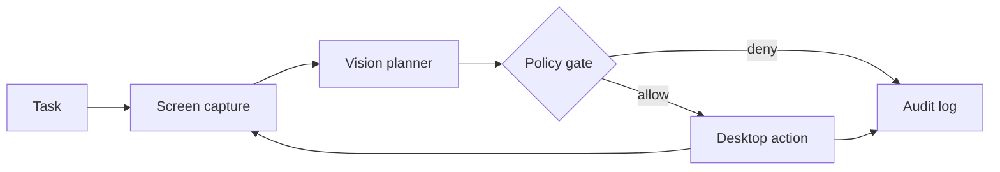
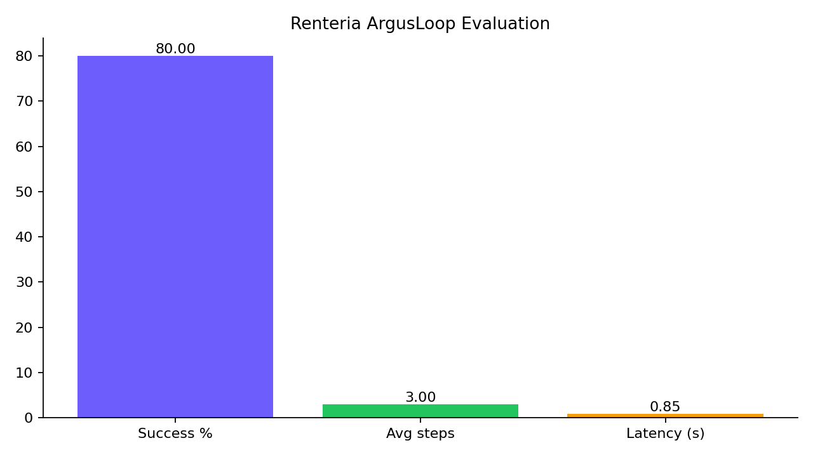

# Renteria ArgusLoop

**A safety-first, auditable vision agent for controlled desktop automation.**

ArgusLoop observes the primary display, asks a multimodal model for exactly one structured
action, passes that proposal through deterministic policy checks, and either executes or blocks
it. It is a ground-up portfolio implementation inspired by the common See–Think–Act pattern;
it is not a copy of the social-media tutorial.

> Safety posture: dry-run by default. Live GUI automation can click the wrong thing. Use only
> on a disposable profile with synthetic data, remain at the computer, and keep PyAutoGUI's
> corner failsafe available.

## Why this version is different

- Typed actions with bounds and cross-field validation
- Dry-run default and explicit risk ceiling
- Deterministic policy gate; critical actions are never automated
- Prompt-injection instructions and sensitive-text detection
- Screenshot hashing and append-only JSONL audit trail
- Correct inclusive coordinate mapping under display scaling
- Unit tests, threat model, evaluation plan, equations, and benchmark chart generator
- No deprecated Google SDK and no hard-coded API key or model secret

## Architecture



## Quick start

Python 3.11+ is recommended. Desktop screenshot access is required.

```bash
python -m venv .venv
source .venv/bin/activate          # Windows: .venv\Scripts\activate
python -m pip install -e ".[dev,charts]"
cp .env.example .env
# Add your GEMINI_API_KEY to .env; never commit it.
pytest
argusloop "Open Calculator"
```

The first run is a dry run: it plans and audits but does not click or type. To opt into
supervised execution, set `ARGUSLOOP_MODE=live`. Keep `ARGUSLOOP_MAX_RISK=medium` or lower.

## Action contract

| Field | Meaning |
|---|---|
| `action` | `click`, `type`, `scroll`, `press_key`, `wait`, or `done` |
| `x`, `y` | Normalized coordinates in `[0,1000]` |
| `risk` | `low`, `medium`, `high`, or `critical` |
| `confidence` | Planner-reported estimate in `[0,1]`; not calibrated |
| `expected_effect` | Visible change expected after execution |

## What the original image tutorial left incomplete

The supplied slides stop partway through the graph implementation and omit the entry point,
error handling, testing, dependency drift strategy, observability, evaluation, prompt-injection
defense, typed validation, approval policy, and a production threat model. ArgusLoop supplies
those missing engineering layers. It intentionally avoids claiming that a general computer-use
agent is “done in 30 minutes”—the demo loop is short; safe engineering is the real work.

## Repository map

```text
src/argusloop/   agent, planner, policy, screen, actions, audit, CLI
tests/           coordinate and safety-policy tests
docs/            architecture/equations, threat model, evaluation plan
scripts/         benchmark summary and chart generator
```

## Limitations

- Primary display only; multi-monitor layouts require a platform adapter.
- Visual localization can fail after layout or theme changes.
- PyAutoGUI cannot provide transactional rollback.
- Model confidence is self-reported and is not a calibrated guarantee.
- Completion currently relies on the planner; an independent verifier is recommended.

## Evaluation preview



This chart is generated from the clearly labeled synthetic rows in
`artifacts/sample-results.jsonl`; it demonstrates the reporting pipeline and is not a claim of
real-world model performance. Replace those rows with controlled-task results before publishing
performance claims.

## Roadmap

1. Independent vision verifier and before/after semantic diff
2. Human approval UI for high-risk actions
3. OS accessibility-tree adapter for more reliable element targeting
4. Signed audit logs and OpenTelemetry traces
5. Containerized benchmark harness with synthetic desktop tasks

## Responsible-use boundary

Do not use this project to bypass access controls, evade monitoring, impersonate people, handle
real credentials, make financial transactions, or operate without the computer owner's explicit
authorization.

## License

MIT. See `LICENSE`.
