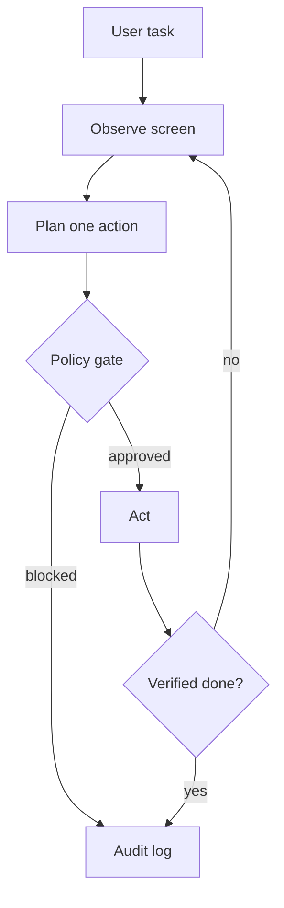

# Architecture and equations

ArgusLoop implements an observe–plan–authorize–act state machine. The model never directly
touches the operating system: every proposed action must pass deterministic policy checks.



## Coordinate transform

For normalized model coordinates `(u, v)` in `[0,1000]^2` and a logical display of `W × H`:

```text
x = round(u(W - 1) / 1000)
y = round(v(H - 1) / 1000)
```

Using `W-1` and `H-1` prevents an edge coordinate of 1000 from becoming an out-of-bounds pixel.

## Run utility and stopping

For step `t`, define progress `p_t`, action-risk cost `r_t`, latency `l_t`, and repetition
penalty `q_t`:

```text
U_t = α p_t - β r_t - γ l_t - δ q_t
```

The loop stops when visible completion is reported, policy blocks the next action, execution
fails, or `t = T_max`. In production, completion should be verified by an independent checker.

## Reliability metrics

For `n` evaluation tasks, success rate and mean steps are:

```text
SR = (1/n) Σ I(success_i)
MS = (1/n) Σ steps_i
```

The benchmark script reports a Wilson 95% interval because plain `p ± 1.96 SE` behaves badly
for small samples and success rates near 0 or 1.

