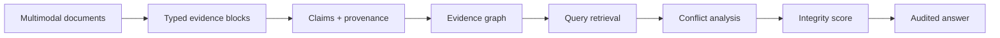

# Renteria EvidenceWeave

> Conflict-aware multimodal evidence intelligence with explainable provenance scoring.

EvidenceWeave turns document content into an inspectable claim ledger. It preserves whether evidence
came from text, a chart, table, equation, or image; connects claims to their exact source blocks;
detects competing values; and scores answer integrity without hiding the inputs behind one opaque
confidence number.

This is a ground-up portfolio product inspired by multimodal GraphRAG architecture. Its original
contribution is a **provenance-first conflict layer** and the transparent **Evidence Integrity Score**.

## Product thesis

Most document-chat systems optimize for a fluent answer. EvidenceWeave optimizes for a defensible
answer—or an explicit abstention when the record does not support one.

## What makes it different

- first-class provenance for text, tables, charts, equations, and images
- claim ledger connecting every answer statement to evidence blocks
- automatic competing-value and contradiction detection
- explainable integrity score with positive and negative components
- source authority, freshness, extraction-confidence, and modality tracking
- deterministic, key-free recruiter demonstration
- modular contracts for later vision, parsing, embedding, and LLM adapters
- tests, model card, equations, architecture, CI, and responsible-use limits

## Architecture



## Evidence Integrity Score

```text
EIS = σ(1.50S + 1.20G + 1.10X + 1.00R + 0.60F - 1.80K - 0.90A - 1.40)
```

`S` semantic relevance, `G` graph support, `X` cross-modal agreement, `R` source reliability,
`F` freshness, `K` contradiction, and `A` ambiguity. See [the equations](docs/equations.md).

## Run the app

```bash
python -m venv .venv
source .venv/bin/activate          # Windows: .venv\Scripts\activate
python -m pip install -e ".[dev]"
python -m pytest
streamlit run app.py
```

The bundled dataset is synthetic and requires no API key. Ask about the selected embedding model or
its accuracy; the dashboard will surface the intentionally planted `0.91` versus `0.88` conflict.

## Repository structure

```text
app.py                         Streamlit recruiter demo
src/evidenceweave/             evidence graph, scoring, pipeline, demo data
tests/                         deterministic unit tests
docs/                          architecture, equations, model card
data/demo_manifest.json        synthetic-data disclosure
.github/workflows/ci.yml       automated quality checks
```

## Production evolution

1. Add MinerU or equivalent typed-layout parsing behind an adapter.
2. Add a vision-description adapter that preserves image hashes and prompts.
3. Add dense embeddings while retaining deterministic lexical fallback.
4. Add LLM claim extraction constrained by a typed schema.
5. Calibrate the Evidence Integrity Score on labeled contradictions and citations.
6. Add signed evidence manifests and document-version lineage.

## Responsible-use boundary

This application supports human review. It does not establish truth and must not make autonomous
medical, legal, employment, credit, insurance, policing, or financial decisions.

## License

MIT.

