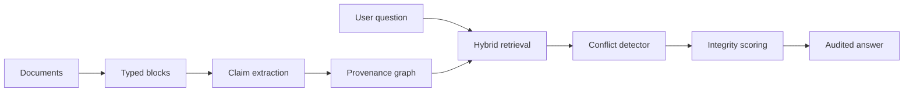

# Architecture

The demonstration ships with deterministic synthetic blocks so recruiters can inspect the complete
logic without API keys or private documents. Production adapters can replace parsing, embedding,
vision description, and generation independently while preserving the claim and scoring contracts.

## Original twist

Traditional multimodal RAG collapses a vision description into text and then largely forgets how
that statement was produced. EvidenceWeave preserves modality, source, page, extraction confidence,
claim lineage, competing values, and scoring components. The output is therefore reviewable as an
evidence product instead of presented as an oracle response.

